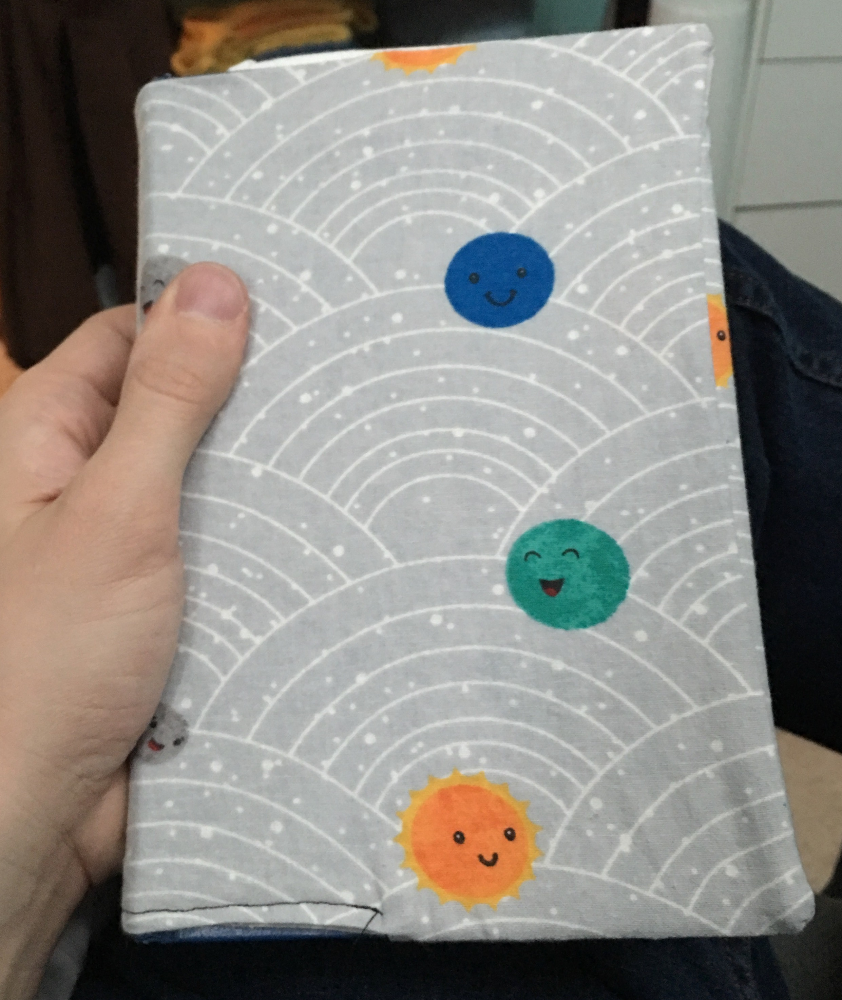

# Simple Fabric Book Cover

This tutorial shows you how to make a book cover that ultimately looks something like this:

and this:

I recently searched for a few good tutorials on making a fabric book cover and found either: 1) things that confused me or 2) were blatantly wrong.

So, here's my take on how to make a fabric book cover.

## Please Note

This is probably the third time I've used a sewing machine in my life.  I have no idea what I'm doing and take no responsibility for any bad advice in this tutorial.  I'm just writing down what seemed to work for me.  I'd _love_ any feedback/suggestions as I'm always looking to improve.

## The Big Idea

The idea is to have a book cover that looks nice on the outside AND the inside.  We're going to cut out four separate pieces of fabric, sew a couple of edges over to avoid fraying, and then sew all the pieces together, flip the thing inside out, and have a nice book cover.

Let's get started.

## Supplies

- Book (that you'd like to cover)
- Ruler (to measure your book)
- Fabric (to cover your book)
- An iron (optional -- I ironed my fabric because it was crumpled and wouldn't measure well)
    - Then, later, I ironed a few of the seams I was going to sew because I hate hate hate pinning fabric
- Scissors or a mat and a rotary cutter (to cut fabric (and hopefully not yourself))
- Needle and Thread or Sewing Machine (to sew fabric)
- Chopstick or something long and pointy (to poke out corners of book cover)
- Access to Google Sheets (because I made a simple spreadsheet to calculate the sizes of your panels)
    - This is optional if you can math on your own

## Measure and Record

- Measure the length (L) of the book (the red line)
    - Write down the measurement.  Maybe here: \_____
- Measure the width (W) of the book (the green line)
    - Write down the measurement.  Maybe here: \_____
- Measure the spine (S) of the book (the blue line)
    - Write down the measurement.  Maybe here: \_____

In one of the tutorials I read, the author mentioned sewing all the panels with a 1/2" seam.  This seamed (ha! see what I did?) to be a good idea to me.  That means, for most of our measurements, we'll be adding a full 1" to each dimension of our panels.

We're going to make two types of panels:

- Main panels
    - These are the panels that cover the outside cover of the book
- Pocket panels
    - These are the panels that form the pockets for your book to slide into

If you'd like to avoid math, I have created a Google Spreadsheet [here](https://docs.google.com/spreadsheets/d/1n8BZWzu1iJhmQGx9nPHhJAAZkFH9uqGZ5npcscKhaeg/edit?usp=sharing)

If you like math, here are the formulas for the dimensions of the two panels

Main Panel:

- Width = 2(Book Width) + Book Spine + 1"
- Height = Book Length + 1"

Pocket Panel:

- Width = Book Width - 1"
- Height = Book Length + 1"

Also, I hate formulas where real numbers are never plugged in.  Here's an example where:

- Width is 5.5"
- Height is 8.5"
- Spine is approximately 1.5"

So, plugging in numbers:

- Main Panel Width = 2(5.5) + 1.5  + 1 = 11 + 2.5 = 13.5"
- Main Panel Height = 8.5 + 1 = 9.5
- Pocket Panel Width = 5.5 - 1 = 4.5
- Pocket Panel Height = 8.5 + 1 = 9.5

## Cut Out Two of Each Panel

The title says it all on this one.  Cut out two main panels and two pocket panels.

**Pro tip**: Try not to cut yourself.  You'll thank yourself later.

## Sew One Edge of Pocket Panels

To keep the pocket panels from unraveling slowly over time, you'll probably want to sew an edge? on the side of the pocket that will not be sewn into the book cover.  Heck, you might even want to employ some sort of fancy stitching for this part, but I'm new to sewing and scared of bending my sewing needle or stabbing myself or running off the edge.

I just folded the cloth over about 1/2", ironed it so it would stay kinda in place (I hate pinning things in place).

Then I did a straight stitch thing.

**Watch Out!**: My fabric clearly had a vertical orientation (I had smiley faces that only looked right-side-up in one direction) and I screwed up and sewed my edge so that one pocket panel ended up having to be sewn in upside down compared to the rest of the cover.  Watch out!

## Make a Book Cover Sandwich

We're going to sew the entire book cover inside out!  That way people can't see that I ended up cutting my main panels different sizes, using wavy lines in my stitches, and having threads fraying all over.  All that stuff will initially be on the outside of the cover and then, once I flip it inside out, all of it will be hidden away from prying and judgemental eyes!

So, first set down a main panel so that the pretty side of the fabric is facing up, towards you.  Think of an open-faced sandwich.  And, if you're hungry, go make a sandwich and come back.  I'll wait here.

Next, place the pocket panels on the main panel so that the rough edges of the pocket panels are flush with the rough edges of the main panel.  Think of them like slightly-too-small pieces of cheese on your sandwich and you want that cheesy goodness at the edges so you get all that yum on the first bite.

Also, make sure that the pocket panels are both either pretty side up or pretty side down.  It doesn't matter which.  It just matters that they both face the same way.

Lastly, we're going to close up our book cover sandwich by placing the second main panel on top of the other main panel and its cheesy pocket panels.  Place this top main panel pretty side down.  The beauty is on the inside, the ugly is on the outside where we do all the sewing.

Congrats!  You're ready to sew that sucker up!

## Sew Good!

First off, heads up: **don't sew the entire book cover closed**.  Leave **2 inches** of the book cover unstitched so you can flip the cover inside out.  If you sew all the edges up right off the bat, you can't flip it inside out and you're stuck with an ugly mat of fabric and your own sense of self-defeat.  Also, make sure the opening is **2 inches**.  I tried to make mine like 1 inch, because, hey, less sewing later, but guess what?!  That 1 inch hole was _too small_ to fit all that book cover goodness through and I tore some stitches and hurt my fingers and felt dumb.  So just go easy on yourself and make it a 2 inch hole.  You'll thank you later.

If you're lame like me and can't sew a straight line to save your life, go ahead and draw a straight line 1/2 inch in from each side of the book cover.  Notice that I left a good 2 inch gap at the bottom of the cover so I would remember not to sew the whole thing closed.

Once you've drawn your lines, go ahead and sew that sucker up.  Take it easy, backstitch as you hit the corners, and do anything else that seems like a sensible sewing technique.  I had no idea what I was doing and my book cover came out fine.  You can do this!

## Trim It Down?

Now, this might turn out to be a Bad Idea in a few months, but once I'd laid down that super-nice 1/2 inch seam all around, I decided to trim off a bit of the excess fabric.  Why?  That way there was less "bulk" around the edges of the book cover when I flipped it inside out.  I cut it _really_ close around the corners too because they were quite rounded if I left all the fabric around the edge.  But, this might be a Bad Idea later on if wear and tear end up weakening my stitching and suddenly my seams start coming undone.  Hopefully by then I'll be _way_ better at sewing and I can make something nicer.

## Flip It Out!

Now you get to see your masterpiece for the first time.  Find that 2 inch hole you left open and shove the book cover through itself using this hole.  It will look _awful_.  Don't worry!

I took a chop stick to poke extra hard at the edges and super-extra hard at the corners.

When I was done, the cover was squarish as could be.

## Finish It!

Now, just fold over the edges of the opening, iron them, and stitch that closed.  At this point I was so excited to be close to the finish line that I forgot to take pictures of any of that. :-(

## You Got It Covered!

Just slide the edges of your book into each pocket and BOOM, you've got yourself a book cover!  I also forgot pictures of this part too.

